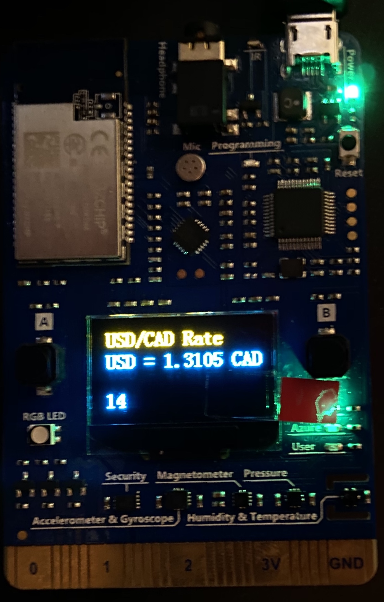
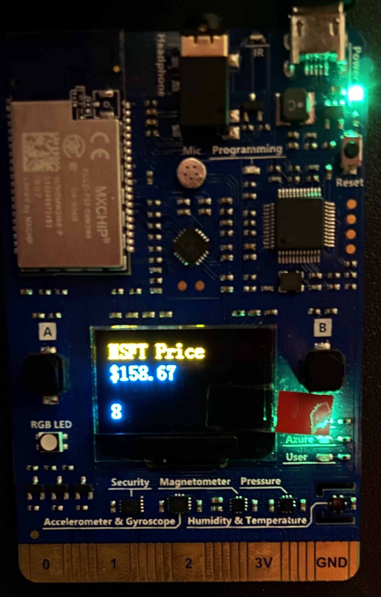
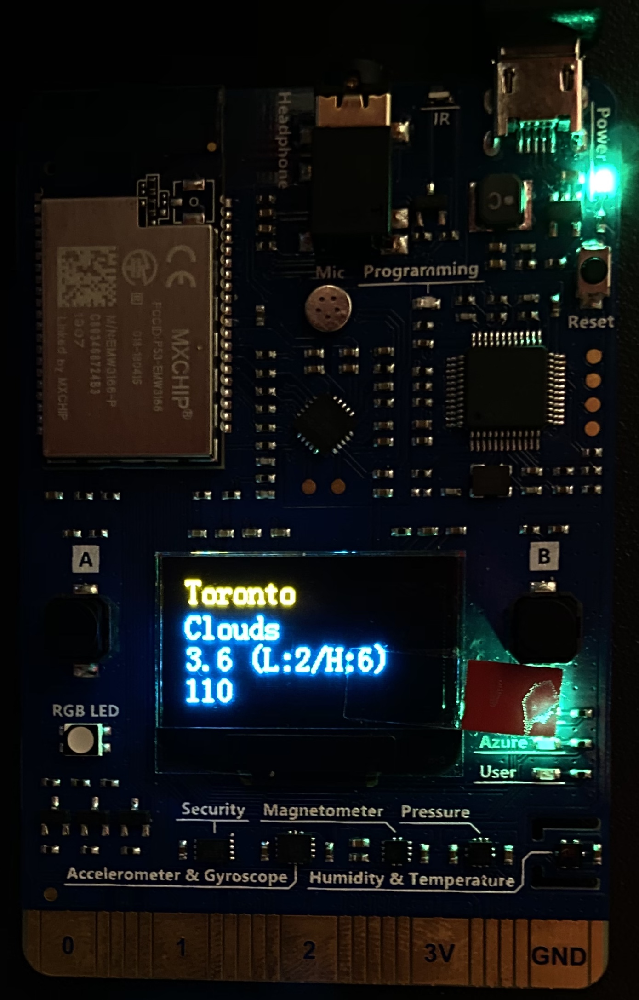

# IoT-Dashboard
View forex, stock, and weather information on your MXChip AZ3166 IoT Devkit

|   |  |  |
|:---:|:---:|:---:|

## Requirements
* [MXChip AZ3166 IoT Devkit](https://aka.ms/iot-devkit-purchase)
* Active Azure subscription with [`iot-dashboard-functions`](https://github.com/JeffreyCA/iot-dashboard-functions) deployed to Azure Functions

## Getting Started
1. Go through the [IoT DevKit Get Started Guide](https://microsoft.github.io/azure-iot-developer-kit/docs/get-started/)
2. `git clone` this repo
3. Fill in the details for the deployed `iot-dashboard-functions` Azure Function in `Device/api.h` (`FUNCTION_KEY` and `FUNCTION_URL`)
4. Configure dashboard properties in `Device/config.h` (`BASE_CURRENCY`, `QUOTE_CURRENCY`, `STOCK_TICKER`, and `WEATHER_LOCATION`)
5. Upload code to DevKit

## Controls
**A Button** - Press to manually switch between foreign exchange rate, stock price, and weather information.

**B Button** - Press to manually refresh data.

## Configuration
### api.h
| Config Value | Description|
|---|---|
|`FUNCTION_KEY` | [`iot-dashboard-functions`](https://github.com/JeffreyCA/iot-dashboard-functions) Azure Function API key |
|`FUNCTION_URL` | [`iot-dashboard-functions`](https://github.com/JeffreyCA/iot-dashboard-functions) Azure Function URL |

### config.h
| Config Value | Description |
|---|---|
|`BASE_CURRENCY` | Base currency symbol (e.g. `USD` / `CAD`) |
|`QUOTE_CURRENCY` | Quote currency symbol (e.g. `CAD` / `USD`) |
|`STOCK_TICKER` | Stock ticker symbol (e.g. `MSFT` / `AAPL`) |
|`WEATHER_LOCATION` | Weather location (e.g. `Toronto` / `Toronto,CA` / `Toronto,Canada`) |
|||
|`CHANGE_VIEW_INTERVAL` | Ticks before view changes |
|`FAIL_REFRESH_INTERVAL` | Ticks before refreshing data due to failure |
|`SUCCESS_REFRESH_INTERVAL` | Ticks before refreshing data when previously successful|
|`SPLASH_DURATION_MS` | Splash image duration in milliseconds|
|`UPDATE_INTERVAL_MS` | Length of each *tick* in milliseconds (e.g. `1000` means each tick is a second) |
|||
|`WIFI_RETRY_STARTING_INTERVAL_MS` | Milliseconds before attempting to reconnect to Wi-Fi for the first time after connection loss |
|`WIFI_RETRY_MULT_FACTOR` | Factor to multiply retry interval by after consecutive connection failures |
